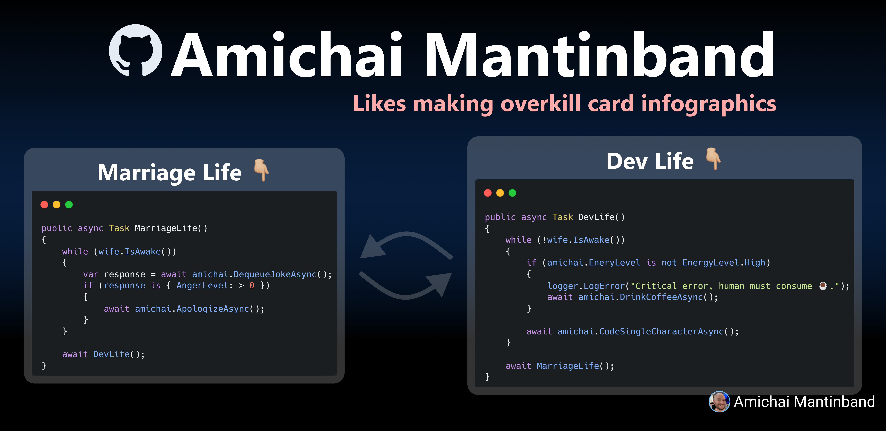

# Hey fellow dev, I'm Amichai 👋

I'm a software engineer @ Microsoft and I love building complex stuff 😎

In my free time I like making overkill infographics and share them on LinkedIn and Twitter 🙌🏼

## I recently started working on this project and looking for devs to join me! 👇🏼

Take a look at the [good first issue tasks](https://github.com/mantinband/throw/labels/good%20first%20issue) and feel free to grab one or more tasks and make it your own 💪🏼

Want to see more?

  
